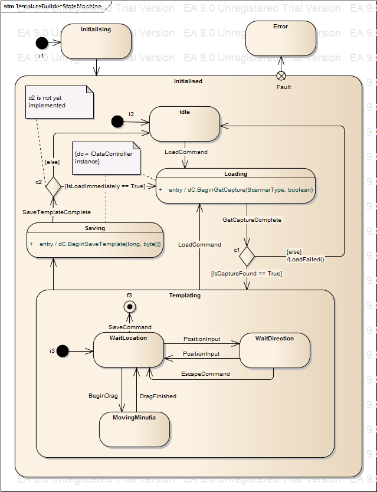

# SimTemplate
##Sam's super awesome template tool. :sunglasses:
A WPF application to facilitate manual construction of templates for captures in the SimPrints database.

### Documentation
The SimTemplate application utilises the [Model-View-ViewModel Pattern](https://en.wikipedia.org/wiki/Model%E2%80%93view%E2%80%93viewmodel), where the ViewModel's behaviour is determined by a state machine implemented using the [State Pattern](https://en.wikipedia.org/wiki/State_pattern).
#### Class View
##### State Machine

##### View Model

#### Logical View
##### State Machine

### TODOs :date:
- [x] Scanner select drop down
- [ ] User guidance
  * Help icon
  * Provide a How To
- [ ] Image rotation
  * Need to check that x y angles are correct. Maybe we re-save the image properly in the DB?
  * Look briefly and if it's a huge pain in the ass ignore NEXT image (for now).
- [ ] REST calls from WPF
  * Query a DB server via REST to get images/templates
  * Appropriate recording of API key (shouldn't save in source code)
- [x] Load templated capture
  * Review template
  * Update template
- [ ] Convert application to asynchronous MVVM
  * See [MSDN blog posts](https://msdn.microsoft.com/en-us/magazine/mt149362?author=Stephen+Cleary)
  * Low priority but a good exercise! All Windows Store apps must 

The proposed tasks above necessitate the following API:

| Function | Send | Receive |
| --- | --- | --- |
| Get Untemplated Capture | Scanner Type | Image, Capture GUID |
| Get Templated Capture | Scanner Type | Image, Capture GUID, Template |
| Save Capture | Template, Capture GUID | *nothing* |

### Comments & Thoughts :thought_balloon:

@TristramN Some thoughts on/options for image rotation:

1. Introduce 'rotate image' feature in app only.
  * Simple
  * Manual rotation on a capture-by-capture basis
  * Templated capture coordinates do not match DB image coordinates
2. Introduce 'rotate image' feature in app and 'Save Capture' operation instructs DB to rotate image file.
  * Requires IsRotated parameter to be added to sent parameters in 'Save Capture' operation
  * Manual rotation on a capture-by-capture basis
  * Templated capture coordinates match DB image coordinates
  * Extra work on server side
3. Programmatically enforce that all images loaded are shown in portrait/All NEXT images are rotated
  * Assumes all images are oriented correctly when portrait/all NEXT images are rotated
  * Automatic
  * Template coordinates do not match DB image coordinates
4. Ensure all images are correct orientation before rolling out app
  * Requires extra work
  * Simplifies app/server
  * Assumes batch script could determine which images need rotating (all portrait/rotate all NEXT images)
